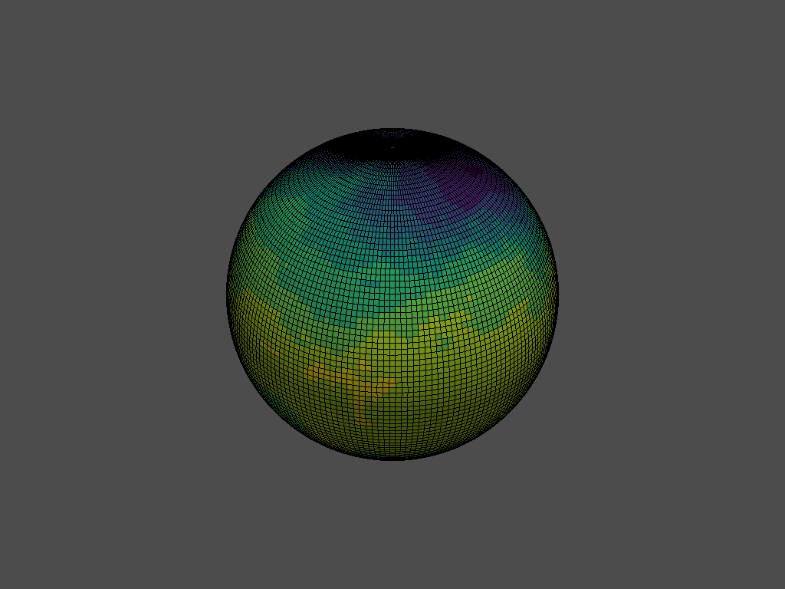

===============================
psy-vtk: VTK plugin for psyplot
===============================

This  proof of concept shows the principal functionality for using vtk inside
the psyplot visualization framework. We use the functionality of psyplot and
combine it with the wonderful vtk interface by pyvista_ [1]_.

You can run some example use cases interactively on mybinder.org: |binder|

.. note::

    This package is in the development mode and it will take several months
    until it is ready for general usage. But we are looking for contributions
    and/or feedback. Just raise a new issue or post your comment in
    `#1`_

.. _pyvista: https://docs.pyvista.org
.. _#1: https://github.com/psyplot/psy-vtk/issues/1

.. |binder| image:: https://mybinder.org/badge_logo.svg
    :target: https://mybinder.org/v2/gh/psyplot/psy-vtk/master?filepath=examples/

Installation
============
As stated above, you can run the latest version of this code from mybinder. If
you, however, want to install this work in progress on your local computer,
we recommend to use conda for it with the provided `environment.yml`_ file.

Clone the repository from github::

    git clone https://github.com/psyplot/psy-vtk.git
    cd psy-vtk

and create the conda environment::

    conda env create -f binder/environment.yml
    conda activate psy-vtk

Now install the package with the ``-e`` flag if you want it as a development
version::

    pip install -e .

If you want to run the notebooks in the examples_ directory, you should also
install jupyter and panel via::

    conda install jupyter

and then you can run the notebook server via::

    PYVISTA_USE_PANEL=true jupyter notebook --notebook-dir=examples

.. _environment.yml: environment.yml
.. _examples: examples

Basic proof of concept for psy-vtk
==================================

As a simple demo: Consider the following basic example (also accessible
as a notebook the `examples/example_basic.ipynb`_ notebook and on
`binder <https://mybinder.org/v2/gh/psyplot/psy-vtk/master?filepath=examples/example_basic.ipynb>`_).

.. code:: ipython3

    import psyplot.project as psy
    import psy_vtk.plotters as pvtk
    ds = psy.open_dataset('demo.nc')
    ds

.. parsed-literal::

    <xarray.Dataset>
    Dimensions:  (lat: 96, lev: 4, lon: 192, time: 5)
    Coordinates:
      * lon      (lon) float64 0.0 1.875 3.75 5.625 7.5 ... 352.5 354.4 356.2 358.1
      * lat      (lat) float64 88.57 86.72 84.86 83.0 ... -83.0 -84.86 -86.72 -88.57
      * lev      (lev) float64 1e+05 8.5e+04 5e+04 2e+04
      * time     (time) datetime64[ns] 1979-01-31T18:00:00 ... 1979-05-31T18:00:00
    Data variables:
        t2m      (time, lev, lat, lon) float32 ...
        u        (time, lev, lat, lon) float32 ...
        v        (time, lev, lat, lon) float32 ...
    Attributes:
        CDI:          Climate Data Interface version 1.6.8 (http://mpimet.mpg.de/...
        Conventions:  CF-1.4
        history:      Mon Aug 17 22:51:40 2015: cdo -r copy test-t2m-u-v.nc test-...
        title:        Test file
        CDO:          Climate Data Operators version 1.6.8rc2 (http://mpimet.mpg....

.. code:: ipython3

    data = ds.psy.t2m[0, 0]

.. code:: ipython3

    globe_plot = pvtk.GlobePlotter(data)
    disp = globe_plot.ax.show()
    disp

.. code:: ipython3

    globe_plot.update(datagrid=True, cmap='viridis')
    disp

.. _examples/example_basic.ipynb: examples/example_basic.ipynb

References
==========
.. [1] Sullivan et al., (2019). PyVista: 3D plotting and mesh analysis through a streamlined interface for the Visualization Toolkit (VTK). Journal of Open Source Software, 4(37), 1450, https://doi.org/10.21105/joss.01450
